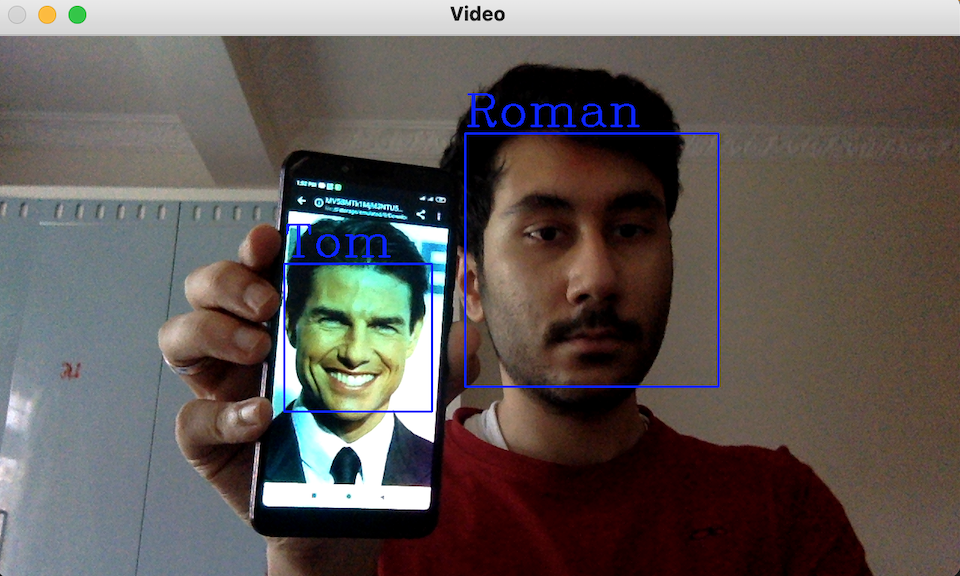

# Face Recognition using OpenCV and Machine Learning
Face recognition in Video Output

## Data Collection
The data can be collected using the video-cam, or from an image already available.

## Working
**Working Steps**
- Face Detection

**OpenCV** library along with **haarcascade** file used for detecting frontal face is used to detect faces in the image/video. The portion of image containing the image is cropped, resized and converted to gray-scale(1D).

- Data Collection

The array output of the gray-scale image along with the name (which is our label/dependent variable) that the user inputs when the code is executed is our training data. This data is stored as a **.npy** file.

- Training

The model is trained using the SVM classifier. 

## How To Use 
1. Clone the project
2. Navigate to the src folder
3. If you have an image input, run the **fetch_face_data(img).py** file.
4. If you want to take input from webcam, run the **fetch_face_data(vid).py** file and also press **c** on your keyboard after the face is detected to collect the numpy data. Then exit by pressing **q**.
5. Run the **face_recog.py** file.

## Output

The model was trained on two different images for the following output.

